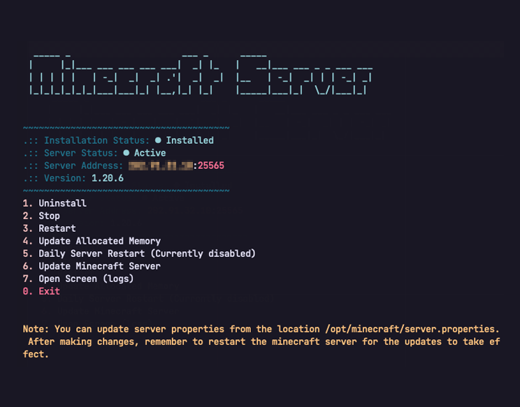

# MC Server



This Bash script facilitates the setup and management of a Minecraft server on Ubuntu/Debian. It automates tasks such as installing dependencies, downloading the Minecraft server files, configuring system services, managing server operations, and more.

## Features

- Interactive setup process for easy configuration.
- Automatic installation of required packages.
- Management of server start, stop, and restart.
- Automated daily server restart.
- Integrated with systemd for service management.

## Prerequisites

- Root access or sudo privileges.

## Installation

1. Clone or download this repository to your Linux system.
2. Make the script executable by running:

   ```bash
   chmod +x mcserver.sh
   ```

3. Run the script as root or with sudo privileges:

   ```bash
   sudo ./mcserver.sh
   ```

Follow the on-screen prompts to set up and configure your Minecraft server.

## License

This repo is released under the [MIT License](LICENSE).

## Credit

The spinner used in this script is adapted from the [bash-spinner](https://github.com/tlatsas/bash-spinner) by Tasos Latsas.

## Contributions

Contributions are welcome! If you find any issues or have suggestions for improvements, please open an issue or submit a pull request.

## Disclaimer

This script is provided as-is, without any warranty. Use it at your own risk.
